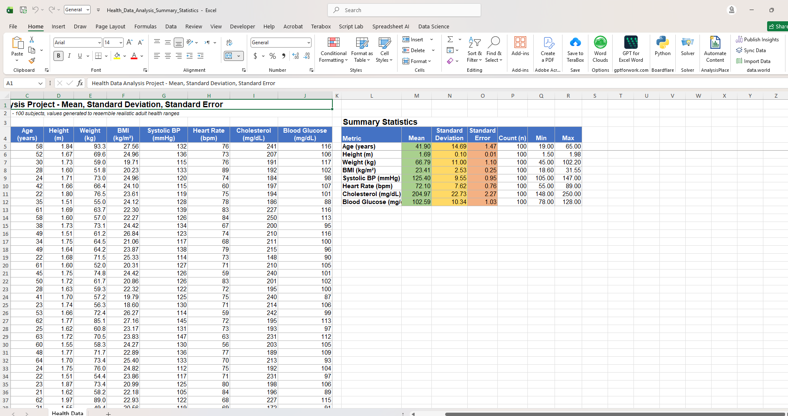

# Health Data Analysis — Mean, Standard Deviation & Standard Error (Excel)

A practice project analyzing a 100-person synthetic health dataset in Excel, calculating Mean, Standard Deviation, and Standard Error for multiple health metrics — all formula-driven.

## What this project does

- 100 synthetic subjects with realistic adult health ranges
- Columns: Subject ID, Gender, Age, Height, Weight, BMI (calculated), Systolic BP, Heart Rate, Cholesterol, Blood Glucose
- A **Summary Statistics** table (same sheet, columns L onward) calculates Mean, SD, SE, Count, Min, and Max for every numeric metric

## How it works (Excel skills used)

| Statistic | Formula | What it tells you |
| --- | --- | --- |
| Mean | `=AVERAGE(range)` | The average value across all 100 people |
| Standard Deviation | `=STDEV(range)` | How spread out individual values are from the mean |
| Standard Error | `=STDEV(range)/SQRT(COUNT(range))` | How precise the mean estimate is (shrinks as sample size grows) |
| BMI | `=Weight/(Height^2)` | Calculated per subject, not hardcoded |

**Note:** this dataset is synthetic (randomly generated within realistic ranges) for practicing statistical formulas — it does not represent real patients.

## How to use

1. Download `Health_Data_Analysis_Summary_Statistics.xlsx`
2. Open in Microsoft Excel or Google Sheets
3. Check the **Summary Statistics** table (right side of the same sheet) for Mean/SD/SE per metric
4. Try changing any value in the data table and watch the statistics recalculate automatically

## Skills demonstrated

- Descriptive statistics formulas (`AVERAGE`, `STDEV`, `COUNT`, `MIN`, `MAX`)
- Calculated columns (BMI from height/weight)
- Structured, formula-driven spreadsheet design (no hardcoded results)
