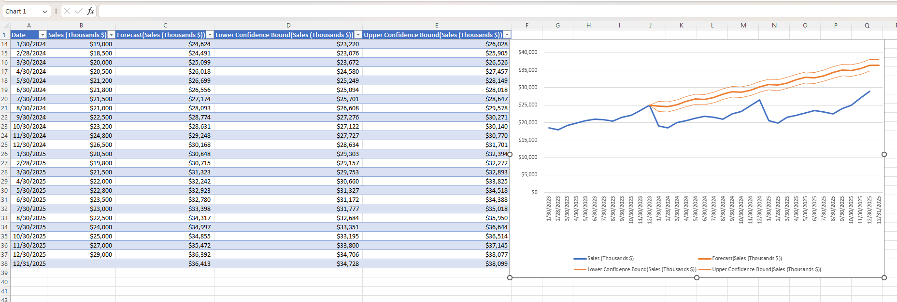

# Sales Forecast Project (Excel)

A monthly sales forecasting project built with Excel's built-in Forecast Sheet tool, projecting future sales along with confidence intervals based on historical data.

## What this project does

- Tracks monthly sales (in thousands of $) from Jan 2023 onward
- Uses Excel's **Forecast Sheet** feature (based on exponential smoothing / `FORECAST.ETS`) to project future months
- Calculates a **Lower Confidence Bound** and **Upper Confidence Bound** for each forecasted value, showing the range the actual result is likely to fall within
- Visualizes actual sales vs forecasted sales on a line chart

## Sheet breakdown

| Sheet | Contents |
|---|---|
| **Sheet1** | Raw monthly sales data with a quarterly Month Reference index (1–4) |
| **Sheet2** | Forecast output: Date, actual Sales, Forecast, Lower/Upper Confidence Bounds, plus the forecast chart |

## How it works (Excel skills used)

| Feature | Tool / Formula |
|---|---|
| Forecasting future sales | Data tab → **Forecast Sheet** (uses `FORECAST.ETS`) |
| Confidence interval | `FORECAST.ETS.CONFINT` (drives the upper/lower bound columns) |
| Seasonal grouping | Month Reference column (1–4 repeating cycle) |
| Trend visualization | Line chart comparing actual vs forecasted sales with shaded confidence range |

## How to use

1. Download `Forecast_Project.xlsx`
2. Open in Microsoft Excel (the Forecast Sheet feature and its charts are an Excel-specific tool — they won't render in GitHub's file preview or in non-Excel viewers)
3. Go to **Sheet2** to see the forecast table and chart
4. To regenerate the forecast with new data: select your data range on Sheet1 → **Data tab → Forecast Sheet**

## Skills demonstrated

- Time series forecasting (`FORECAST.ETS`)
- Confidence interval calculation
- Chart-based trend visualization
- Structured historical data with a seasonal reference index
